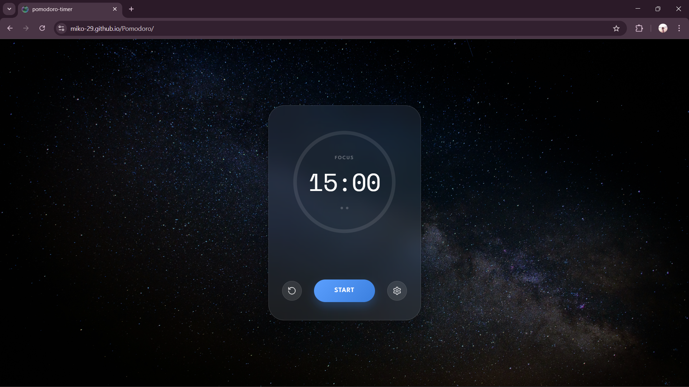
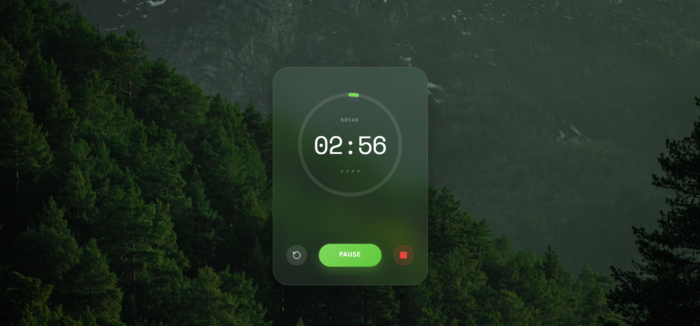
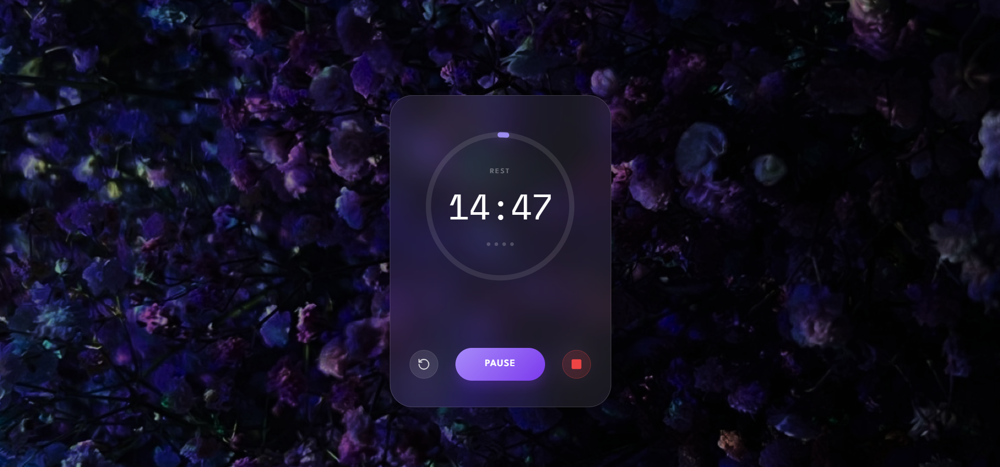

# 🍅 Pomodoro Timer

A beautiful, customizable Pomodoro timer to boost your productivity. Designed in Figma and built with modern web technologies.

<div align="center">
  
  
  
</div>

<br/>

<div align="center">
  <h3>🎥 Watch the Demo</h3>
  <video src="public/PomodoroAppDemo.mp4" controls width="80%"></video>
  <br/>
</div>

## ✨ Features

- **Customizable Intervals**: Set your preferred duration for Focus, Short Break, and Long Break sessions.
- **Audio Feedback**: Pleasant notification sounds to alert you when a session ends.
- **Visual Progress**: Circular progress indicator with a specialized conic gradient design.
- **Glassmorphism UI**: Sleek, modern interface with transparency and blur effects.
- **Responsive Design**: Works perfectly on desktop and mobile devices.
- **Smart Transitions**: Automatically switches between modes based on your workflow.

## 🛠️ Tech Stack

- **React 19**: For building the user interface.
- **TypeScript**: For type-safe code and better developer experience.
- **Vite**: For lightning-fast development and optimized production builds.
- **Tailwind CSS**: For utility-first styling and rapid UI development.
- **Lucide React**: For beautiful, consistent icons.

## 🚀 Getting Started

### Prerequisites

Make sure you have Node.js installed on your machine.

### Installation

1.  Clone the repository:
    ```bash
    git clone https://github.com/your-username/pomodoro-timer.git
    ```
2.  Navigate to the project directory:
    ```bash
    cd pomodoro-timer
    ```
3.  Install dependencies:
    ```bash
    npm install
    ```

### Running the App

Start the development server:

```bash
npm run dev
```

Open [http://localhost:5173](http://localhost:5173) to view it in your browser.

### Building for Production

To create a production-ready build:

```bash
npm run build
```

## 🎨 Design

This project implements a custom design focused on clarity and aesthetics suitable for everyday use.

