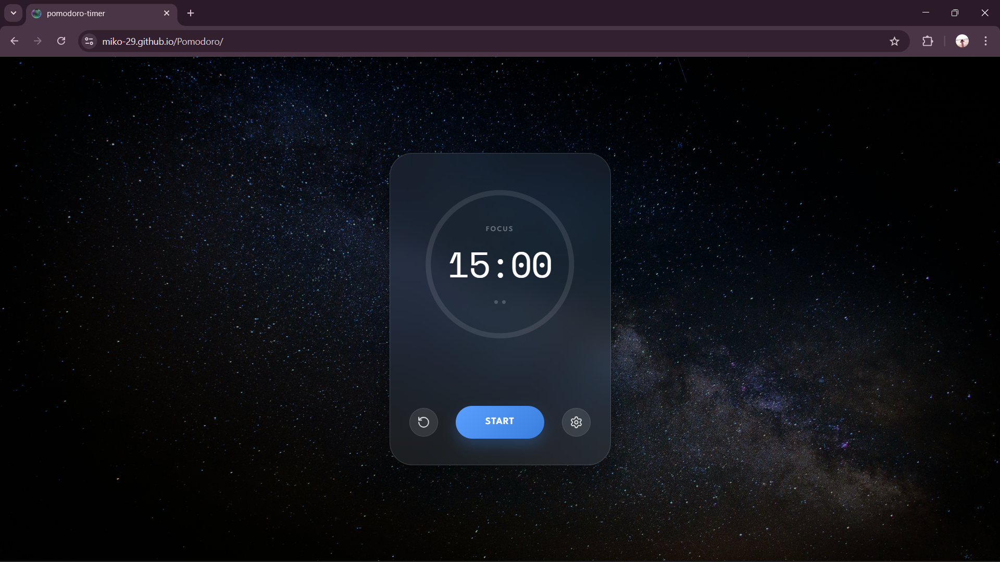
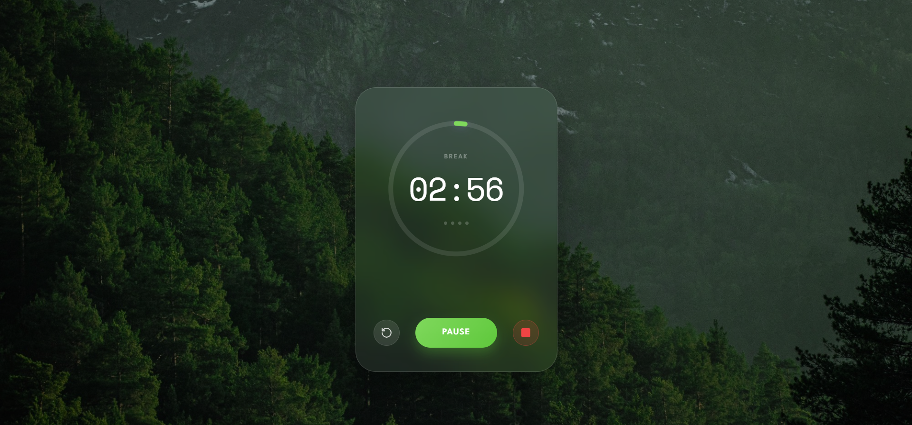
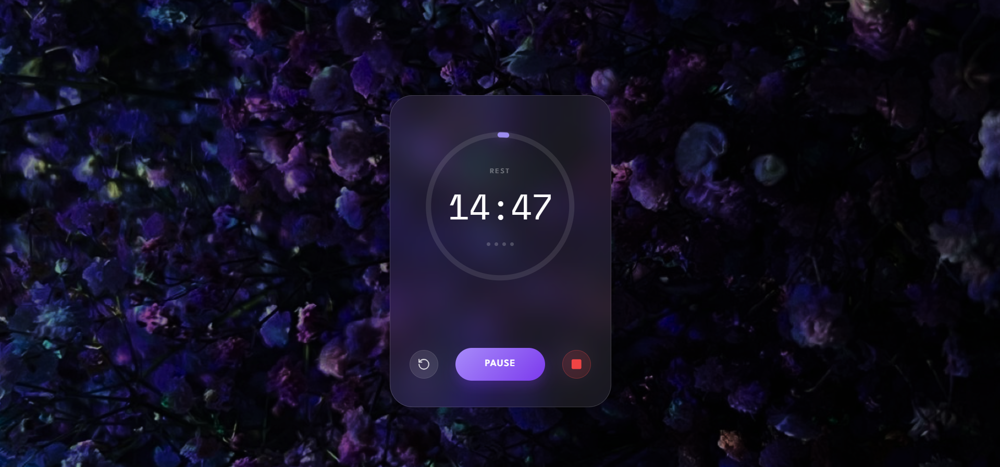

# 🍅 Pomodoro Timer — Free Online Focus & Productivity Timer

> **[▶ Use the Pomodoro Timer](https://miko-29.github.io/Pomodoro/)** — Free, no signup, works in any browser.

A beautiful, free **Pomodoro timer** built with modern web technologies. Use the **Pomodoro Technique** to boost your focus and productivity with 25-minute work sessions and short breaks. Designed in Figma, optimized for speed and accessibility.

<div align="center">
  
  
  
</div>

<br/>

<div align="center">
  <h3>🎥 Watch the Demo</h3>
  <video src="public/PomodoroAppDemo.mp4" controls width="80%"></video>
  <br/>
</div>

## ✨ Features

- **🍅 Pomodoro Technique Timer**: 25-minute focused work sessions with structured breaks
- **⏱️ Customizable Intervals**: Set your preferred duration for Focus, Short Break, and Long Break sessions
- **🔔 Audio Feedback**: Pleasant notification sounds to alert you when a session ends
- **📊 Visual Progress**: Circular progress indicator with a specialized conic gradient design
- **🎨 Glassmorphism UI**: Sleek, modern interface with transparency and blur effects
- **📱 Responsive Design**: Works perfectly on desktop and mobile devices
- **🔄 Smart Transitions**: Automatically switches between modes based on your workflow
- **⌨️ Keyboard Shortcuts**: Start, pause, reset with keyboard for faster workflow
- **♿ Accessible**: ARIA labels, keyboard navigation, screen reader support
- **🆓 100% Free**: No signup, no download, no ads — just a focus timer

## 🚀 Live Demo

**👉 [https://miko-29.github.io/Pomodoro/](https://miko-29.github.io/Pomodoro/)**

Use it as a **study timer**, **work timer**, or **productivity timer** — the Pomodoro Technique helps you maintain focus with structured intervals.

## 🛠️ Tech Stack

- **React 19**: For building the user interface
- **TypeScript**: For type-safe code and better developer experience
- **Vite**: For lightning-fast development and optimized production builds
- **Tailwind CSS**: For utility-first styling and rapid UI development
- **Lucide React**: For beautiful, consistent icons

## 📖 What is the Pomodoro Technique?

The **Pomodoro Technique** was developed by Francesco Cirillo in the late 1980s. It's a time management method that uses a timer to break work into 25-minute intervals (called "pomodoros") separated by short breaks:

1. **Focus** for 25 minutes
2. **Short Break** for 5 minutes
3. **Repeat** 4 times
4. **Long Break** for 15–30 minutes

This rhythm helps maintain concentration, reduce mental fatigue, and combat procrastination.

## 🚀 Getting Started

### Prerequisites

Make sure you have Node.js installed on your machine.

### Installation

1.  Clone the repository:
    ```bash
    git clone https://github.com/miko-29/Pomodoro.git
    ```
2.  Navigate to the project directory:
    ```bash
    cd Pomodoro/pomodoro-timer
    ```
3.  Install dependencies:
    ```bash
    npm install
    ```

### Running the App

Start the development server:

```bash
npm run dev
```

Open [http://localhost:5173](http://localhost:5173) to view it in your browser.

### Building for Production

To create a production-ready build:

```bash
npm run build
```

### Deploy to GitHub Pages

```bash
npm run deploy
```

## 🎨 Design

This project implements a custom design focused on clarity and aesthetics suitable for everyday use.

## 🔑 Keywords

`pomodoro timer` · `pomodoro` · `pomodoro technique` · `focus timer` · `productivity timer` · `25 minute timer` · `study timer` · `online timer` · `free pomodoro timer` · `work timer` · `tomato timer`

## 📄 License

Open source — free to use and modify.

## 👤 Author

**[miko-29](https://github.com/miko-29)**
